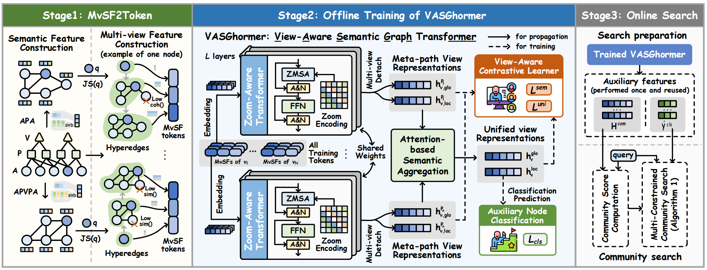

## SCSAH

This is the pytorch implementation of paper "Scalable Unsupervised Community Search via Graph Transformer over Attributed Heterogeneous Information Networks"



## Requirements
```
torch                     2.2.0
torch_geometric           2.5.3
torch-scatter             2.1.1
torch-sparse              0.6.17
torchvision               0.17.0
numpy                     1.23.5
pandas                    2.0.3
```


## Usage

This repository contains the code for our proposed SCSAH framework. `MvSF2Token.py` is responsible for precomputing MvSFs (Multi-view Structural Features). The `VASGhormer_and_layers.py` includes the implementation of our VASGhormer model and its internal components, while `Online_Search.py` contains the code for the online community search process. Due to storage limitations, we only provide the preprocessed IMDB dataset in this repository. For the other datasets mentioned in the paper, please refer to the dataset section of the paper and download them from the corresponding sources.

To run our framework, first execute the offline stage, which includes MvSF2Token construction and offline training, by running `python Offline_Training.py`. The model checkpoint that performs best on the validation set will be automatically saved.

After offline training, use `python Online_Search.py` to perform online community search on the test set using the saved model. This will evaluate the performance of the trained model and output the community search results.

